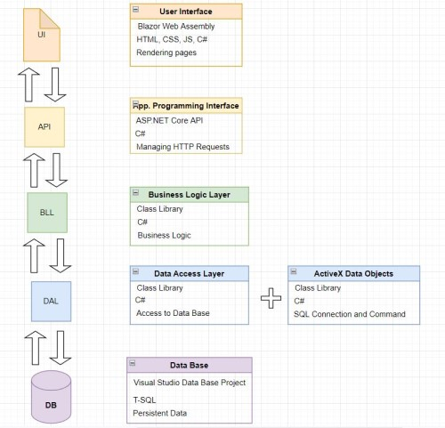

Bugtracker.API
==============

## The aim of this project 
Bugtracker is a web application designed to track bugs encountered during the development of various software products.  
I wrote this program myself, mainly during the last month of my professional training  in .NET development at Digitalcity.brussels.

This project was the first big project in my adventure as a web and software developer.  
I built it in about a month, in July 2022. I dare say that this project no longer reflects my current skills, as I've learned other concepts and techniques that have helped me progress.

## Architecture
This section presents the back-end server, consisting mainly of an ASP.NET API linked via several intermediate layers (Business Logic Layer and Data Access Layer) to the SQL Server database.  
The system architecture is therefore an N-tier architecture.  
The database is created via Transact-SQL scripts, and its data is accessed via ADO.NET.

## Authentication
I have written a custom authentication system with Json Web Tokens (JWT). I am aware that this is not good practice.  
Recreating this system gave me a better understanding of how authentication works on a website. This project was never intended to be deployed anyway.  

I worked on it to practice the concepts I'd learned during my training and to show potential recruiters what I was capable of achieving in a relatively short time.

## Link to the frontend Blazor project
This repository contains only the back end.  
To examine the front end, you can consult my project created with Blazor, a framework for creating web site user interfaces using C# and web assembly technology, at this address : [Bugtracker.WASM-repo](https://github.com/PhilemonPhilippin/Bugtracker.WASM-repo).